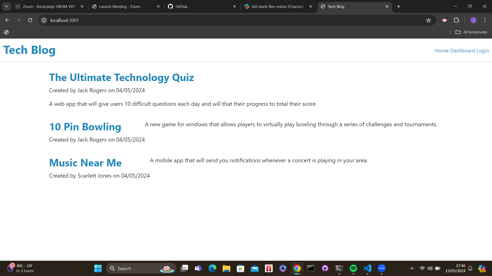

# 14th-Challenge-Tech-Blog

## What was my objective and what have i achieved?
In this project i was tasked with creating a fully functioning tech blog, which i believe i has acheived this by ensuring that the user is able to view, add and delete posts. I have also ensured that the user has to be logged in for them to add and delete any current/new posts.

In addition i was also tasked with ensuring that the user is able to view and add comments to any current/new post which i have successfully been able to do by making sure that the user can type a new comment in which is then displayed in the comments section of that post.

https://one4th-challenge-tech-blog-6.onrender.com/

